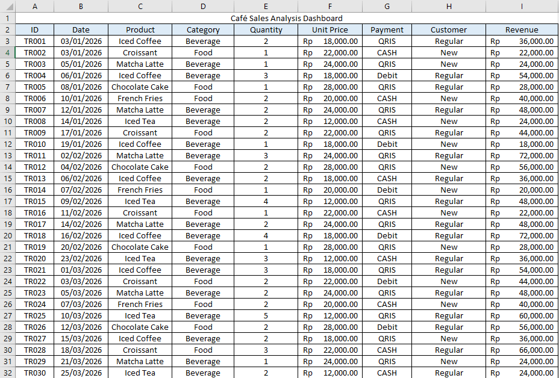
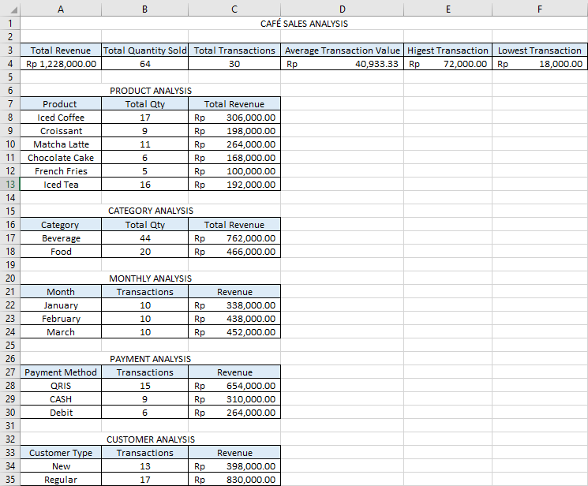

# Cafe Sales Analysis

An Excel-based project to analyze cafe sales data and identify patterns in sales performance, product performance, and customer types.

## About the Project

Cafe businesses record many transactions every day. However, transaction data alone does not directly show which products perform well, how sales change over time, or which customer types contribute to sales.

This project was created to practice analyzing sales data and turning the data into information that can be used to understand business performance.

## Project Objectives

The objectives of this project are:

- Analyze total revenue and sales performance
- Identify sales trends by month
- Find products with the highest sales and revenue
- Compare sales based on customer type
- Present the analysis in a simple dashboard

## Analysis

The analysis focuses on several areas:

- Monthly Sales
- Revenue
- Product Performance
- Customer Type
- Sales Trends

## Impact

This analysis can help a cafe owner or manager get a clearer view of their business performance.

For example, the results can be used to:

- Identify products that generate higher revenue
- See changes in sales over time
- Understand which customer types contribute more to sales
- Use sales information as a reference when making business decisions

The project is based on a mock dataset, so the results are intended for analysis practice rather than actual business decisions.

## Tools

- Microsoft Excel
- PivotTable
- Charts
- Data Analysis

## Project Files

- `Cafe Sales Analysis Dashboard.xlsx`
- `screenshots/`

## Screenshots

### Dashboard

### Analysis

